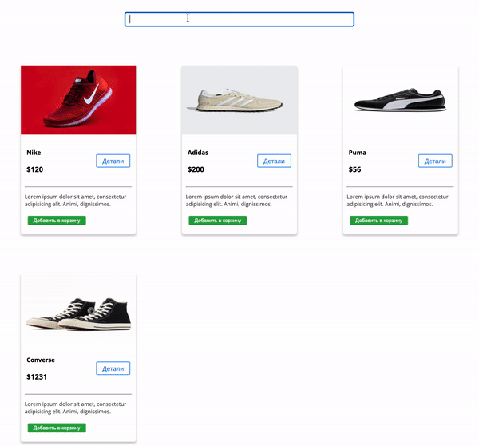

Live Search
===

## Задача

Используя сделанные в ранее компонент "карточка товара" - тебе нужно
вывести список товаров и реализовать "живой поиск" по этим товарам.

## State

Товары будут храниться в стейте в виде массива из объектов. Обязательно должны присутствовать ключи:
`name`, `img`, `price`. Добавь минимум 6 товаров.

## Поиск

Поиск начинается сразу же, как будет введен первый символ в поле ввода, кнопки для отправки не нужно.
На странице будут рендериться отфильтрованные данные.
Поиск ведется только по ключу `name`.
